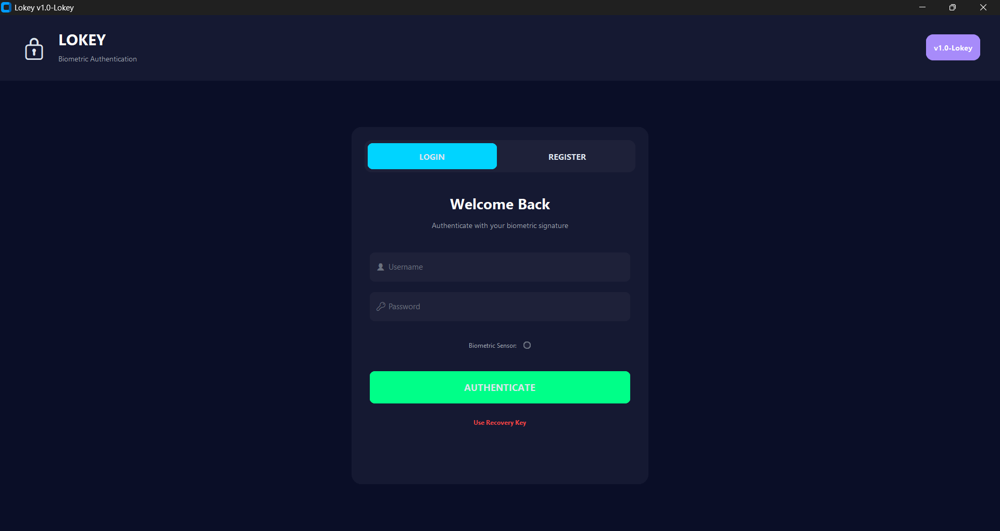

# 🔒 Lokey – Behavioral Biometrics & Secure Storage

**Lokey** is a local-first authentication prototype that combines standard credentials with **behavioral biometrics** (keystroke dynamics). It explores the trade-offs between usability, security, and machine learning robustness in a desktop environment.

  

## 🧠 Core Concept
Instead of relying solely on passwords, Lokey analyzes **how** a user types. Using an unsupervised **Isolation Forest** algorithm, it establishes a baseline of the user's typing rhythm (dwell times). If the typing pattern deviates significantly—even if the password is correct—the system flags the anomaly.

## 🛠️ System Architecture
* **Biometric Engine:** Real-time keystroke capture utilizing `pynput` with an **Isolation Forest** (Unsupervised Anomaly Detection) for user verification.
* **Security Layer:**
    * **Atomic File Encryption:** AES-128-CBC (Fernet) with atomic writes to prevent data corruption.
    * **Secure Backups:** AES-GCM encrypted JSON exports for model portability.
    * **Storage:** SQLite in WAL (Write-Ahead Logging) mode with thread-safe locking.
* **Interface:** Modern, responsive UI built with `CustomTkinter`, featuring asynchronous non-blocking sensor updates.

